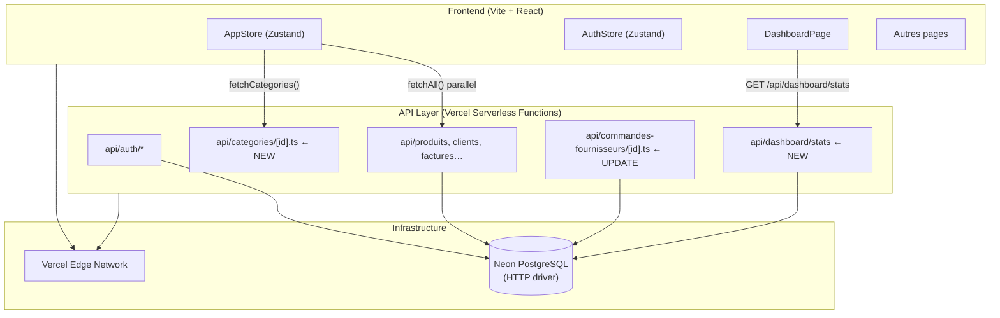

# Design Document — backend-production-ready

## Overview

Ce document décrit l'architecture technique et les décisions de design pour rendre le backend Kiosq entièrement prêt pour la production. L'objectif est de combler les lacunes restantes entre l'état actuel du code et un déploiement Vercel qui affiche des données réelles à la place des mocks sur toutes les pages.

### État actuel

Le projet dispose déjà d'une infrastructure solide :

- **API** : Vercel Serverless Functions sous `api/` (TypeScript, `@vercel/node`)
- **ORM** : Drizzle ORM avec Neon PostgreSQL via le driver HTTP serverless
- **Auth** : JWT signé HS256, transmis par cookie HttpOnly `kiosq_token`
- **Frontend** : React 19 + Zustand, bascule automatique mock/API via `VITE_API_URL`
- **Endpoints existants** : auth, clients, produits, commandes, factures, fournisseurs, catégories (GET/POST), commandes-fournisseurs, utilisateurs, POS/vente

### Lacunes identifiées

1. **`api/categories/[id].ts`** — fichier absent (PATCH/DELETE catégories non exposés)
2. **`api/dashboard/stats`** — endpoint absent (Dashboard utilise encore `mockDataCA`)
3. **`server.ts`** — nouvelles routes non enregistrées
4. **Frontend Dashboard** — KPI charts câblés sur `mockDataCA` en dur
5. **Commandes fournisseurs** — la mise à jour de stock à la réception n'est pas encore implémentée dans le handler actuel (pas de déduction/ajout de stock au changement de statut vers `recu`)
6. **Seed** — ne contient pas de commandes, factures, ni données suffisantes pour les graphiques du dashboard

---

## Architecture

### Vue d'ensemble



### Principes de déploiement

- **Sans état** : chaque function crée sa propre connexion Neon HTTP via `getDb()` — pas de pool persistant
- **Même domaine** : en production Vercel, front et API partagent le même domaine (`kiosq.vercel.app`), donc `VITE_API_URL` est vide — les appels font `/api/…` relatifs
- **Dev local** : `server.ts` (Express) émule le runtime Vercel sur le port 3001, Vite proxyfie `/api/*` vers `localhost:3001`

---

## Components and Interfaces

### 1. `api/categories/[id].ts` (nouveau fichier)

Handler Vercel standard couvrant PATCH et DELETE pour une catégorie donnée.

```typescript
// Méthodes supportées
PATCH /api/categories/:id  → { nom?, description?, couleur? } → Categorie (200)
DELETE /api/categories/:id → (rôle admin requis)              → { message: string } (200)
```

**Contrôle d'accès** :
- PATCH : tous les rôles authentifiés (admin / gestionnaire minimum — cohérent avec les autres ressources de catalogue)
- DELETE : rôle `admin` uniquement

**Schéma Zod** :
```typescript
const PatchSchema = z.object({
  nom:         z.string().min(1).optional(),
  description: z.string().optional(),
  couleur:     z.string().optional(),
});
```

### 2. `api/dashboard/stats/index.ts` (nouveau fichier)

Endpoint de statistiques agrégées calculées directement en SQL.

```typescript
GET /api/dashboard/stats → DashboardStats (200)

interface DashboardStats {
  caMonth: number;           // CA des factures payées ce mois
  commandesActives: number;  // Commandes en statut actif (hors annulé/livré)
  alertesStock: number;      // Produits actifs avec stockActuel <= stockMinimum
  facturesEnRetard: number;  // Somme des resteAPayer pour statut = 'en_retard'
  caParMois: {
    label: string;   // 'Jan', 'Fév', …
    valeur: number;  // CA TTC total des factures payées ce mois
    commandes: number; // Nombre de factures payées ce mois
  }[];                       // Toujours 12 entrées (12 derniers mois glissants)
}
```

**Calculs SQL via Drizzle** :
- `caMonth` : `SUM(total_ttc)` WHERE `statut = 'payee'` AND `date_facture` dans le mois courant
- `commandesActives` : `COUNT(*)` WHERE `statut IN ('brouillon','envoye','confirme','en_preparation','expedie')`
- `alertesStock` : `COUNT(*)` WHERE `stock_actuel <= stock_minimum AND actif = true`
- `facturesEnRetard` : `SUM(reste_a_payer)` WHERE `statut = 'en_retard'`
- `caParMois` : boucle sur les 12 derniers mois côté JS, requête par mois ou GROUP BY côté SQL

**Décision de design** : les 12 mois sont calculés côté JavaScript en itérant depuis le mois courant jusqu'à 11 mois en arrière, avec une seule requête qui récupère toutes les factures des 12 derniers mois. C'est plus simple à maintenir qu'une requête GROUP BY avec gestion des mois manquants en SQL, et la volumétrie de factures reste raisonnable.

### 3. Mise à jour de `api/commandes-fournisseurs/[id].ts`

Le handler existant gère déjà GET, PATCH et POST. Il manque la logique de **mise à jour du stock** lors du passage au statut `recu` ou `recu_partiel`.

**Comportement attendu lors de PATCH `{ statut: "recu" }` ou `{ statut: "recu_partiel" }` :**
- Pour chaque ligne de la commande : `produit.stockActuel += ligne.quantiteRecue`
- Pour `statut = "recu"` : `dateReception = now()` (déjà implémenté pour `recu`, à vérifier pour `recu_partiel`)
- La mise à jour du stock ne doit s'effectuer qu'une seule fois (vérifier que le statut précédent n'était pas déjà `recu`)

### 4. Mise à jour de `server.ts`

Enregistrement des deux nouvelles routes :

```typescript
// Catégories — route paramétrique
app.all('/api/categories/:id', async (req, res) => {
  req.query.id = req.params.id;
  const { default: handler } = await import('./api/categories/[id].ts');
  await handler(req as never, res as never);
});

// Dashboard stats
app.get('/api/dashboard/stats', adapt('./api/dashboard/stats/index.ts'));
```

### 5. Mise à jour du `DashboardPage.tsx`

- Remplacer les références à `mockDataCA` par les données issues de `GET /api/dashboard/stats`
- Ajouter `dashboardStats` dans l'`AppStore` ou via un `useState` local dans `DashboardPage`
- La solution la plus propre : un `useState` local dans `DashboardPage` qui appelle `dashboardApi.stats()` au montage (évite d'alourdir l'AppStore avec des données qui ne sont utiles qu'au dashboard)

```typescript
// Dans api.ts
export const dashboardApi = {
  stats: () => get<DashboardStats>('/api/dashboard/stats'),
};
```

### 6. Mise à jour du `db/seed.ts`

Ajouter des commandes, factures et commandes fournisseurs pour alimenter les graphiques du dashboard en développement. Les données doivent couvrir plusieurs mois pour que `caParMois` soit représentatif.

---

## Data Models

Les modèles de données sont définis dans `db/schema.ts` — aucun changement de schéma n'est nécessaire pour cette feature. Tous les champs requis par les nouvelles fonctionnalités existent déjà.

### Champs utilisés par `dashboard/stats`

| Table | Champs |
|-------|--------|
| `factures` | `statut`, `total_ttc`, `reste_a_payer`, `date_facture` |
| `commandes` | `statut` |
| `produits` | `stock_actuel`, `stock_minimum`, `actif` |

### Champs utilisés par la mise à jour de stock CF

| Table | Champs |
|-------|--------|
| `commandes_fournisseurs` | `statut`, `lignes` (JSONB), `date_reception` |
| `produits` | `stock_actuel`, `updated_at` |

### Structure JSONB des lignes d'une commande fournisseur

```typescript
interface LigneCF {
  produitId:     string;
  produitRef:    string;
  produitNom:    string;
  quantite:      number;
  quantiteRecue: number;  // Utilisé pour la mise à jour du stock
  prixAchat:     number;
  total:         number;
}
```

---

## Correctness Properties

*A property is a characteristic or behavior that should hold true across all valid executions of a system — essentially, a formal statement about what the system should do. Properties serve as the bridge between human-readable specifications and machine-verifiable correctness guarantees.*

### Property 1 : Conversion numérique complète

*For any* objet retourné par `numericRow()` contenant l'un des champs listés dans le `Numeric_Helper` sous forme de chaîne numérique, après application de `numericRow()`, chacun de ces champs doit être de type `number` JavaScript, et tous les autres champs de l'objet doivent rester inchangés (type et valeur).

**Validates: Requirements 6.1, 6.4**

---

### Property 2 : Invariant financier des paiements CF

*For any* commande fournisseur existante avec un `totalTTC` donné, et *for any* montant de paiement valide (> 0 et tel que `montantPaye + montant <= totalTTC`), après enregistrement du paiement : `montantPaye_new + resteAPayer_new = totalTTC` ET `montantPaye_new = montantPaye_old + montant`.

**Validates: Requirements 5.3**

---

### Property 3 : Autorisation par rôle — mutations interdites au lecteur

*For any* endpoint de ressource protégé (clients, produits, commandes, factures, fournisseurs, catégories) et *for any* méthode HTTP de mutation (POST, PATCH, DELETE), une requête authentifiée avec le rôle `lecteur` doit toujours retourner HTTP 403.

**Validates: Requirements 8.4**

---

### Property 4 : Accès DELETE catégories réservé à l'admin

*For any* catégorie existante et *for any* rôle différent de `admin` (commercial, gestionnaire, comptable, lecteur), une requête DELETE sur `/api/categories/:id` doit retourner HTTP 403.

**Validates: Requirements 1.4**

---

### Property 5 : caParMois — complétude sur 12 mois

*For any* ensemble de données de factures (y compris vide), le champ `caParMois` retourné par `/api/dashboard/stats` doit toujours contenir exactement 12 entrées, chaque entrée ayant un champ `valeur` ≥ 0 et un champ `commandes` ≥ 0. Pour les mois sans facture, `valeur = 0` et `commandes = 0`.

**Validates: Requirements 2.2, 2.3**

---

### Property 6 : Mise à jour de stock à la réception CF

*For any* commande fournisseur au statut différent de `recu`, contenant *any* ensemble de lignes avec des `quantiteRecue` > 0, lors du passage au statut `recu`, le `stockActuel` de chaque produit référencé doit augmenter d'exactement `ligne.quantiteRecue`.

**Validates: Requirements 5.1**

---

## Error Handling

### Stratégie uniforme

Tous les endpoints utilisent les helpers `ok()` et `err()` de `api/_lib/response.ts` :

```typescript
// Succès
{ ok: true, data: T }

// Erreur
{ ok: false, error: string }
```

Le frontend détecte les erreurs via `if (!res.ok || !json.ok)` dans `api.ts` et lance une exception avec le message d'erreur.

### Codes d'erreur par cas

| Cas | Code HTTP |
|-----|-----------|
| Ressource introuvable | 404 |
| Token absent | 401 `"Non authentifié"` |
| Token expiré / malformé | 401 `"Token invalide ou expiré"` |
| Rôle insuffisant | 403 `"Accès refusé"` |
| Données invalides (Zod) | 422 `"Données invalides"` |
| Overpayment CF | 400 `"Montant dépasse le total dû"` |
| Stock insuffisant | 400 `"Stock insuffisant pour…"` |
| Erreur DB | 500 `"Erreur serveur"` |

### Gestion des erreurs au chargement initial (Frontend)

Le `fetchAll()` dans l'AppStore ignore actuellement les erreurs silencieusement. Pour respecter le requirement 4.5, il faut propager les erreurs ou exposer un état d'erreur dans le store. La solution recommandée : un champ `error: string | null` dans l'AppStore, mis à jour si l'une des requêtes parallèles échoue, et affiché dans `AppLayout`.

### Erreur de `DATABASE_URL` manquante

`getDb()` lance déjà `new Error('DATABASE_URL is not set')`. Le seed script propage l'erreur avec `process.exit(1)`. Aucun changement nécessaire.

---

## Testing Strategy

### Approche duale

- **Tests unitaires** : exemples spécifiques, cas limites, comportements d'intégration entre composants
- **Tests de propriétés** : propriétés universelles vérifiées sur de nombreuses entrées générées aléatoirement

Les deux sont complémentaires : les tests unitaires couvrent les scénarios concrets et les erreurs de configuration, les tests de propriétés garantissent la correction générale sur l'espace d'entrée.

### Librairie PBT recommandée

**[fast-check](https://fast-check.dev/)** — librairie TypeScript de property-based testing, compatible avec Vitest (le runner de test standard pour les projets Vite).

```bash
npm install --save-dev vitest @vitest/coverage-v8 fast-check
```

### Tests unitaires (exemples et cas limites)

- `GET /api/categories/:id` inexistant → 404
- `DELETE /api/categories/:id` admin → 200 + message correct
- Seed lancé deux fois → pas de doublons
- `POST /api/commandes-fournisseurs/:id` avec overpayment → 400
- PATCH statut `recu` d'une CF → `dateReception` définie
- Dashboard sans données → `caParMois` de 12 zéros

### Tests de propriétés (fast-check, minimum 100 itérations)

Chaque test référence la propriété du design via un commentaire de tag :

#### Property 1 — Conversion numérique complète

```typescript
// Feature: backend-production-ready, Property 1: numericRow converts all numeric fields to numbers
it.prop([fc.record({
  prixAchat: fc.float({ min: 0 }).map(String),
  prixVente: fc.float({ min: 0 }).map(String),
  totalTTC:  fc.float({ min: 0 }).map(String),
  nom:       fc.string(),         // champ non-numérique
  actif:     fc.boolean(),        // champ non-numérique
})])('numericRow converts numeric string fields to numbers', (row) => {
  const result = numericRow(row);
  expect(typeof result.prixAchat).toBe('number');
  expect(typeof result.prixVente).toBe('number');
  expect(typeof result.totalTTC).toBe('number');
  expect(result.nom).toBe(row.nom);     // inchangé
  expect(result.actif).toBe(row.actif); // inchangé
});
```

#### Property 2 — Invariant financier paiements CF

```typescript
// Feature: backend-production-ready, Property 2: payment invariant montantPaye + resteAPayer = totalTTC
it.prop([
  fc.float({ min: 1, max: 100000 }).map(v => Math.round(v * 100) / 100), // totalTTC
  fc.float({ min: 0 }).chain(totalTTC => fc.float({ min: 0, max: totalTTC })), // montantActuel
  fc.float({ min: 0.01 }), // paiement
])('payment invariant holds', (totalTTC, montantActuel, paiement) => {
  fc.pre(montantActuel + paiement <= totalTTC);
  const resteAPayer = totalTTC - (montantActuel + paiement);
  const montantPaye = montantActuel + paiement;
  expect(Math.round((montantPaye + resteAPayer) * 100)).toBe(Math.round(totalTTC * 100));
});
```

#### Property 3 — Mutations interdites au lecteur

```typescript
// Feature: backend-production-ready, Property 3: lecteur role cannot mutate resources
it.prop([
  fc.constantFrom('/api/clients', '/api/produits', '/api/factures', '/api/categories'),
  fc.constantFrom('POST', 'PATCH', 'DELETE'),
])('lecteur receives 403 for mutation methods', async (route, method) => {
  const res = await fetchWithRole(route, method, 'lecteur');
  expect(res.status).toBe(403);
});
```

#### Property 4 — DELETE catégorie réservé à l'admin

```typescript
// Feature: backend-production-ready, Property 4: only admin can delete categories
it.prop([
  fc.constantFrom('commercial', 'gestionnaire', 'comptable', 'lecteur'),
])('non-admin role gets 403 on DELETE categories', async (role) => {
  const res = await fetchWithRole('/api/categories/c1', 'DELETE', role);
  expect(res.status).toBe(403);
});
```

#### Property 5 — caParMois complétude

```typescript
// Feature: backend-production-ready, Property 5: caParMois always has 12 entries with non-negative values
it.prop([
  fc.array(fc.record({
    statut: fc.constantFrom('payee', 'brouillon', 'annulee', 'en_retard'),
    totalTTC: fc.float({ min: 0, max: 10000000 }).map(String),
    dateFacture: fc.date({ min: new Date('2023-01-01'), max: new Date() }),
  })),
])('caParMois always has 12 entries', (faktureSeed) => {
  const stats = computeStats(faktureSeed);
  expect(stats.caParMois).toHaveLength(12);
  stats.caParMois.forEach(entry => {
    expect(entry.valeur).toBeGreaterThanOrEqual(0);
    expect(entry.commandes).toBeGreaterThanOrEqual(0);
    expect(typeof entry.label).toBe('string');
  });
});
```

#### Property 6 — Mise à jour stock CF

```typescript
// Feature: backend-production-ready, Property 6: receiving a CF increases product stock by quantiteRecue
it.prop([
  fc.array(fc.record({
    produitId: fc.string({ minLength: 1 }),
    quantiteRecue: fc.integer({ min: 1, max: 100 }),
  }), { minLength: 1, maxLength: 10 }),
])('receiving CF increases each product stock by quantiteRecue', async (lignes) => {
  // Setup: create products with known initial stock
  // Act: PATCH CF to statut=recu
  // Assert: each product stockActuel increased by ligne.quantiteRecue
  // (implementation uses in-memory mock of DB calls)
});
```

### Configuration Vitest

```typescript
// vitest.config.ts
import { defineConfig } from 'vitest/config';
export default defineConfig({
  test: {
    include: ['**/*.test.ts', '**/*.spec.ts'],
    environment: 'node',
    coverage: { provider: 'v8', reporter: ['text', 'lcov'] },
  },
});
```

Chaque test de propriété est configuré pour un minimum de 100 runs via la configuration par défaut de fast-check (`numRuns: 100`).
