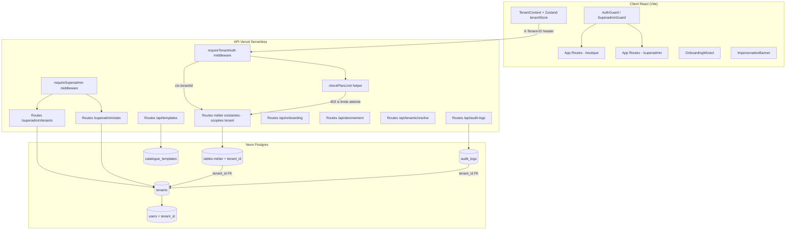

# Design — Gestion Multi-Tenant

## Vue d'ensemble

Ce document décrit l'architecture et la conception technique pour transformer Kiosq d'un ERP mono-tenant en une plateforme SaaS multi-boutiques. La stratégie retenue est l'**isolation par colonne `tenant_id`** (Row-Level Security applicatif) : toutes les tables métier reçoivent une colonne `tenant_id` filtrée à chaque requête SQL via un middleware API.

### Décisions architecturales clés

- **Isolation applicative plutôt que PostgreSQL RLS** : plus simple à maintenir avec Drizzle ORM, compatible avec les Vercel Serverless Functions sans connexion persistante.
- **JWT comme vecteur de tenant** : le `tenantId` est embarqué dans le JWT à la connexion, évitant un aller-retour DB à chaque requête pour résoudre le tenant.
- **Slug pour le routage** : chaque boutique est accessible via `{slug}.kiosq.app` ou `/app/{slug}`, résolu côté client avant l'authentification.
- **fast-check pour les property tests** : bibliothèque PBT mature pour TypeScript/Node.js, compatible avec Vitest.

---

## Architecture



---

## Composants et interfaces

### Middleware API

#### `api/_lib/auth.ts` — extensions

```typescript
// Type AuthContext étendu
export type AuthContext = {
  sub: string;
  email: string;
  role: string;
  nom: string;
  prenom: string;
  tenantId: string | null;      // null pour superadmin
  impersonatedBy?: string;      // présent si session d'impersonation
};

// signToken étendu
export async function signToken(payload: {
  sub: string;
  email: string;
  role: string;
  nom: string;
  prenom: string;
  tenantId?: string | null;
  impersonatedBy?: string;
  expiresIn?: string;           // '2h' pour impersonation, '7d' par défaut
}): Promise<string>

// Nouveau helper
export async function requireSuperadmin(
  req: VercelRequest,
  res: VercelResponse
): Promise<AuthContext | null>
// Vérifie ctx.role === 'superadmin', retourne 403 sinon

// Nouveau helper (remplace requireAuth dans les routes existantes)
export async function requireTenantAuth(
  req: VercelRequest,
  res: VercelResponse
): Promise<AuthContext | null>
// requireAuth + vérifie tenantId non null
// Vérifie en DB que le tenant est actif (pas suspendu, pas essai expiré, pas en maintenance)
// Retourne 403 avec message approprié si bloqué
```

#### `api/_lib/planLimits.ts` — nouveau fichier

```typescript
export const PLAN_LIMITS = {
  starter:    { users: 2,        produits: 500,      magasins: 1,        leads: false, whatsapp: false },
  pro:        { users: 10,       produits: Infinity, magasins: 3,        leads: true,  whatsapp: true  },
  enterprise: { users: Infinity, produits: Infinity, magasins: Infinity, leads: true,  whatsapp: true  },
} as const;

export type PlanName = keyof typeof PLAN_LIMITS;
export type LimitedResource = 'users' | 'produits' | 'magasins';

export async function checkPlanLimit(
  db: Db,
  tenantId: string,
  resource: LimitedResource,
  res: VercelResponse
): Promise<boolean>
// Retourne true si la limite n'est pas atteinte
// Retourne false et écrit la réponse 403 si la limite est atteinte

export function getPlanLimitForResource(
  plan: PlanName,
  resource: LimitedResource
): number
```

### Résolution de tenant côté client

#### `src/lib/tenant.ts`

```typescript
export async function resolveTenantFromUrl(): Promise<{
  tenantId: string;
  slug: string;
  nom: string;
  plan: 'starter' | 'pro' | 'enterprise';
  statut: 'actif' | 'suspendu' | 'essai';
} | null>
// Lit le hostname ({slug}.kiosq.app) ou le pathname (/app/{slug})
// Appelle GET /api/tenants/resolve?slug=xxx
// Met le résultat en cache sessionStorage (TTL: 60s)

export function getTenantId(): string | null
// Lit depuis sessionStorage ou le store Zustand

export function generateSlug(nom: string): string
// Transforme un nom en slug URL-safe : [a-z0-9-], min 1 char, pas de - en début/fin
```

### Context et Store React

#### `src/contexts/TenantContext.tsx`

```typescript
interface TenantContextValue {
  tenantId: string | null;
  tenantNom: string | null;
  plan: 'starter' | 'pro' | 'enterprise' | null;
  statut: 'actif' | 'suspendu' | 'essai' | null;
}

export const TenantContext = createContext<TenantContextValue | null>(null);
export const useTenant = (): TenantContextValue => { /* hook */ }
```

#### `src/store/tenantStore.ts`

```typescript
interface TenantState {
  tenantId: string | null;
  nom: string | null;
  plan: 'starter' | 'pro' | 'enterprise' | null;
  statut: 'actif' | 'suspendu' | 'essai' | null;
  isImpersonating: boolean;
  impersonatedTenantNom: string | null;
  resolve: (slug: string) => Promise<void>;
  clearImpersonation: () => void;
}
```

---

## Modèles de données

### Nouvelles tables Drizzle

#### `tenants`

```typescript
export const planEnum = pgEnum('plan_tenant', ['starter', 'pro', 'enterprise']);
export const statutTenantEnum = pgEnum('statut_tenant', ['actif', 'suspendu', 'essai']);

export const tenants = pgTable('tenants', {
  id:                 text('id').primaryKey(),
  nom:                text('nom').notNull(),
  slug:               text('slug').notNull().unique(),
  domaine:            text('domaine'),
  plan:               planEnum('plan').notNull().default('essai'),
  statut:             statutTenantEnum('statut').notNull().default('essai'),
  dateEssaiFin:       timestamp('date_essai_fin'),
  logoUrl:            text('logo_url'),
  devise:             text('devise').notNull().default('XOF'),
  pays:               text('pays'),
  telephone:          text('telephone'),
  email:              text('email').notNull(),
  adresse:            text('adresse'),
  enMaintenance:      boolean('en_maintenance').notNull().default(false),
  messageMaintenance: text('message_maintenance'),
  createdAt:          timestamp('created_at').notNull().defaultNow(),
  updatedAt:          timestamp('updated_at').notNull().defaultNow(),
});
```

#### `audit_logs`

```typescript
export const auditLogs = pgTable('audit_logs', {
  id:           text('id').primaryKey(),
  tenantId:     text('tenant_id').notNull().references(() => tenants.id),
  userId:       text('user_id').references(() => users.id),
  action:       text('action').notNull(),
  resourceType: text('resource_type').notNull(),
  resourceId:   text('resource_id'),
  details:      jsonb('details'),
  ipAddress:    text('ip_address'),
  createdAt:    timestamp('created_at').notNull().defaultNow(),
});
```

#### `catalogue_templates`

```typescript
export const catalogueTemplates = pgTable('catalogue_templates', {
  id:              text('id').primaryKey(),
  tenantId:        text('tenant_id').notNull().references(() => tenants.id),
  nom:             text('nom').notNull(),
  description:     text('description'),
  secteurActivite: text('secteur_activite'),
  payload:         jsonb('payload').notNull(), // { categories: [], produits: [] }
  createdAt:       timestamp('created_at').notNull().defaultNow(),
});
```

### Migrations des tables existantes

Chaque table ci-dessous reçoit une colonne `tenant_id text NOT NULL REFERENCES tenants(id)` avec un index :

```typescript
// Pattern appliqué à chaque table (exemple : produits)
export const produits = pgTable('produits', {
  // ... colonnes existantes ...
  tenantId: text('tenant_id').notNull().references(() => tenants.id),
});
// Index correspondant
// CREATE INDEX idx_produits_tenant_id ON produits(tenant_id);
```

Tables concernées : `categories`, `magasins`, `fournisseurs`, `produits`, `clients`, `commandes`, `factures`, `commandes_fournisseurs`, `parametres`, `unites`, `groupes_surveilles`, `leads`.

La table `users` reçoit :
- `tenantId text REFERENCES tenants(id)` (nullable — null pour superadmin)
- `premiereConnexion boolean NOT NULL DEFAULT true`
- `onboardingStep integer NOT NULL DEFAULT 0`

### Type `TenantConfig` (pour parseur/sérialiseur)

```typescript
export interface TenantConfig {
  id: string;
  nom: string;
  slug: string;
  domaine: string | null;
  plan: 'starter' | 'pro' | 'enterprise';
  statut: 'actif' | 'suspendu' | 'essai';
  dateEssaiFin: string | null;  // ISO 8601
  logoUrl: string | null;
  devise: string;
  pays: string | null;
  telephone: string | null;
  email: string;
  adresse: string | null;
  enMaintenance: boolean;
  messageMaintenance: string | null;
  createdAt: string;            // ISO 8601
  updatedAt: string;            // ISO 8601
}

export function parseTenantConfig(raw: unknown): TenantConfig
// Lève une erreur descriptive si le format est invalide

export function serializeTenantConfig(config: TenantConfig): string
// Produit un JSON valide et lisible (JSON.stringify avec indentation)
```

### Nouvelles routes API

#### Routes superadmin

| Méthode | Route | Description |
|---------|-------|-------------|
| `GET` | `/api/superadmin/tenants` | Liste de toutes les boutiques |
| `POST` | `/api/superadmin/tenants` | Créer une boutique |
| `GET` | `/api/superadmin/tenants/[id]` | Détail d'une boutique |
| `PATCH` | `/api/superadmin/tenants/[id]` | Modifier plan / statut / maintenance |
| `DELETE` | `/api/superadmin/tenants/[id]` | Supprimer une boutique |
| `POST` | `/api/superadmin/tenants/[id]/impersonate` | Émettre JWT temporaire 2h |
| `POST` | `/api/superadmin/tenants/[id]/clone` | Cloner catalogue + config |
| `GET` | `/api/superadmin/stats` | KPIs globaux, MRR, courbe 12 mois |
| `GET` | `/api/superadmin/audit-logs` | Logs de tous les tenants |
| `GET` | `/api/superadmin/templates` | Liste des templates catalogue |
| `DELETE` | `/api/superadmin/templates/[id]` | Supprimer un template |

#### Routes tenant

| Méthode | Route | Description |
|---------|-------|-------------|
| `GET` | `/api/tenants/resolve?slug=xxx` | Résoudre tenantId depuis slug ou domaine |
| `GET` | `/api/audit-logs` | Logs du tenant courant |
| `GET` | `/api/abonnement` | Usage actuel vs limites plan |
| `GET/PATCH` | `/api/onboarding` | État et progression du wizard |
| `GET/POST` | `/api/templates` | Marketplace + export catalogue |
| `POST` | `/api/templates/[id]/import` | Importer un template |

### Pattern de migration des routes existantes

**Avant :**
```typescript
const ctx = await requireAuth(req, res);
const rows = await db.select().from(produits).orderBy(desc(produits.updatedAt));
```

**Après :**
```typescript
const ctx = await requireTenantAuth(req, res);
if (!ctx) return;
const rows = await db.select().from(produits)
  .where(eq(produits.tenantId, ctx.tenantId!))
  .orderBy(desc(produits.updatedAt));
// Pour POST (création) :
if (!await checkPlanLimit(db, ctx.tenantId!, 'produits', res)) return;
```

---

## Composants React — Superadmin Backoffice

```
src/pages/superadmin/
  SuperadminLayout.tsx          — layout dédié (sidebar sombre, logo plateforme)
  DashboardSuperadminPage.tsx   — KPIs, MRR, courbe boutiques (Recharts)
  BoutiquesPage.tsx             — liste filtrable par plan/statut/recherche
  BoutiqueDetailPage.tsx        — détail + actions (suspendre, changer plan, impersonner)
  CreerBoutiquePage.tsx         — formulaire de création de boutique

src/components/superadmin/
  BoutiqueCard.tsx              — carte résumé d'un tenant
  PlanBadge.tsx                 — badge coloré Starter/Pro/Enterprise
  ImpersonationBanner.tsx       — bannière orange mode impersonation
  StatsChart.tsx                — courbe 12 mois (Recharts LineChart)
```

**Routing dans `App.tsx` :**
```tsx
<Route path="/superadmin" element={<SuperadminGuard />}>
  <Route index element={<DashboardSuperadminPage />} />
  <Route path="boutiques" element={<BoutiquesPage />} />
  <Route path="boutiques/new" element={<CreerBoutiquePage />} />
  <Route path="boutiques/:id" element={<BoutiqueDetailPage />} />
</Route>
```

`SuperadminGuard` : vérifie `user.role === 'superadmin'`, redirige vers `/login` avec status 403 sinon.

## Onboarding Wizard

`src/components/onboarding/OnboardingWizard.tsx` — modal plein écran en 5 étapes :

1. Configuration entreprise (logo, nom, devise)
2. Premier produit
3. Premier client
4. Première commande
5. Inviter un collègue

État persisté via `PATCH /api/onboarding` (champ `onboardingStep` en DB).
Déclenché automatiquement si `user.premiereConnexion === true`.

## Page Mon Abonnement

`src/pages/configuration/AbonnementPage.tsx` :
- Plan actif avec `PlanBadge`
- Barre de progression pour chaque ressource limitée (ProgressBar)
- Tableau comparatif des plans
- Bouton « Contacter pour upgrader »

## Script de migration des données existantes

`db/migrate-to-multitenant.ts` :
1. Créer le tenant `"Kiosq Default"` (`id: 'tenant-default'`, `slug: 'default'`, `plan: 'enterprise'`, `statut: 'actif'`)
2. Créer le compte superadmin (`email: 'superadmin@kiosq.app'`, `role: 'superadmin'`, `tenantId: null`)
3. `UPDATE` toutes les tables métier `SET tenant_id = 'tenant-default'` pour les enregistrements sans `tenant_id`
4. Ajouter contrainte `NOT NULL` sur `tenant_id` (sauf `users` qui garde nullable)
5. Créer les index `tenant_id` sur toutes les tables métier

---

## Propriétés de correction

*Une propriété est une caractéristique ou un comportement qui doit rester vrai pour toutes les exécutions valides d'un système — essentiellement, un énoncé formel de ce que le système doit faire. Les propriétés servent de pont entre les spécifications lisibles par l'humain et les garanties de correction vérifiables automatiquement.*

### Réflexion sur la redondance

Avant de lister les propriétés finales, une révision des candidats issus du prework :

- Les propriétés 3.4 (rejet tenant suspendu) et 3.5 (rejet essai expiré) sont des variantes de la même règle d'accès — elles peuvent être combinées en une seule propriété sur la validation du statut de tenant.
- Les propriétés 1.3 (extraction tenantId du JWT) et 3.1 (JWT contient tenantId à la connexion) forment un round-trip JWT : émission → vérification. Une seule propriété round-trip couvre les deux.
- Les propriétés 7.1–7.3 (définition des limites) et 7.4–7.7 (rejet à la limite) sont distinctes : l'une teste la structure de `PLAN_LIMITS`, l'autre teste le comportement à l'exécution.
- Les propriétés 6.1 et 6.2 (impersonation) sont complémentaires mais distinctes (contenu du JWT vs durée).

---

### Propriété 1 : Isolation des données entre tenants

*Pour tout* couple de tenants distincts (A ≠ B) et toute ressource appartenant au tenant B, une requête API effectuée avec le JWT du tenant A ne doit jamais retourner cette ressource — elle doit obtenir soit une réponse 404, soit une liste vide.

**Valide : Requirements 1.5, 1.6**

---

### Propriété 2 : Round-trip du JWT tenant

*Pour tout* utilisateur avec un `tenantId` non null, signer un token avec `signToken({ ..., tenantId })` puis le vérifier avec `verifyToken` doit produire un payload dont `tenantId` est identique à la valeur d'origine.

**Valide : Requirements 3.1, 1.3**

---

### Propriété 3 : Rejet des tenants non actifs

*Pour tout* tenant dont le statut est `suspendu`, ou dont le statut est `essai` avec une `date_essai_fin` dans le passé, ou dont le flag `en_maintenance` est `true` — toute requête à l'API présentant un JWT avec ce `tenantId` doit être rejetée avec un code HTTP 4xx ou 503 (jamais 2xx).

**Valide : Requirements 3.4, 3.5, 16.2**

---

### Propriété 4 : Génération de slug URL-safe

*Pour tout* nom de boutique (chaîne quelconque non vide), la fonction `generateSlug(nom)` doit produire une chaîne qui : ne contient que les caractères `[a-z0-9-]`, commence et se termine par `[a-z0-9]`, et a une longueur minimale de 1.

**Valide : Requirements 2.3**

---

### Propriété 5 : Monotonie des limites de plan

*Pour tout* couple de plans consécutifs `(starter → pro)` et `(pro → enterprise)`, et toute ressource numérique (`users`, `produits`, `magasins`), la limite du plan supérieur doit être supérieure ou égale à celle du plan inférieur : `PLAN_LIMITS[plan_supérieur][ressource] >= PLAN_LIMITS[plan_inférieur][ressource]`.

**Valide : Requirements 7.1, 7.2, 7.3**

---

### Propriété 6 : Rejet à l'atteinte des limites de plan

*Pour tout* tenant dont l'usage d'une ressource limitée est exactement égal à sa `PLAN_LIMITS[plan][ressource]`, toute tentative de création d'une nouvelle instance de cette ressource doit retourner un statut HTTP 403.

**Valide : Requirements 7.4, 7.5, 7.6**

---

### Propriété 7 : Scope du JWT d'impersonation

*Pour tout* couple (superadmin S, tenant T), le JWT émis par l'endpoint d'impersonation doit satisfaire simultanément : `payload.tenantId === T.id`, `payload.impersonatedBy === S.id`, `payload.role === 'admin'`, et `payload.exp - payload.iat <= 7200` (≤ 2 heures).

**Valide : Requirements 6.1, 6.2**

---

### Propriété 8 : Complétude des audit logs

*Pour toute* action appartenant à la liste définie dans le Requirement 11.2 (création/modification/suppression facture, création/suppression produit, connexion, déconnexion, création/désactivation utilisateur, démarrage/fin impersonation), après l'exécution de l'action, le nombre d'entrées dans `audit_logs` pour ce `(tenantId, action)` doit être égal au nombre d'avant + 1.

**Valide : Requirements 11.2**

---

### Propriété 9 : Round-trip de TenantConfig

*Pour tout* objet `TenantConfig` valide, désérialiser le résultat de la sérialisation doit produire un objet dont toutes les propriétés sont équivalentes à l'objet d'origine : `parseTenantConfig(serializeTenantConfig(config))` ≅ `config`.

**Valide : Requirements 17.4, 17.1, 17.3**

---

### Propriété 10 : Round-trip d'export/import de catalogue

*Pour tout* catalogue de tenant (ensemble de catégories et produits), exporter le catalogue en `Template_Catalogue` puis l'importer dans un nouveau tenant doit produire un catalogue dont toutes les désignations, descriptions et références (hors suffixes de déduplication) sont présentes dans le tenant importateur et scopées à son `tenant_id`.

**Valide : Requirements 14.1, 14.3, 14.5**

---

### Propriété 11 : Résolution de tenant depuis l'URL

*Pour tout* slug d'un tenant existant, `resolveTenantFromUrl()` invoqué avec une URL contenant ce slug doit retourner un objet dont le `tenantId` correspond exactement à `tenants.id` du tenant associé à ce slug.

**Valide : Requirements 9.1, 9.2**

---

## Gestion des erreurs

### Codes HTTP standardisés

| Situation | Code | Message |
|-----------|------|---------|
| JWT absent ou invalide | 401 | `"Non authentifié"` |
| Tenant suspendu | 403 | `"Boutique suspendue. Contactez le support."` |
| Essai expiré | 403 | `"Période d'essai expirée. Veuillez souscrire à un plan."` |
| En maintenance | 503 | `messageMaintenance` du tenant |
| Limite de plan atteinte | 403 | `"Limite de {ressource} atteinte pour le plan {plan}. Passez au plan {plan_supérieur}."` |
| Accès cross-tenant | 404 | `"Ressource introuvable"` (ne révèle pas l'existence) |
| Rôle insuffisant (non-superadmin sur route superadmin) | 403 | `"Accès refusé"` |
| Slug invalide | 422 | `"Slug invalide : {détail des caractères non autorisés}"` |
| Config tenant invalide | 422 | `"Configuration invalide : {champs manquants ou invalides}"` |

### Propagation d'erreurs dans `requireTenantAuth`

```
1. Extraire token → 401 si absent/invalide
2. Vérifier tenantId dans JWT → 401 si absent (non-superadmin)
3. Charger tenant depuis DB → 404 si introuvable
4. Vérifier statut actif → 403 si suspendu
5. Vérifier essai non expiré → 403 si expiré
6. Vérifier en_maintenance → 503 si maintenance (sauf superadmin)
7. Retourner AuthContext enrichi
```

### Cohérence X-Tenant-ID header

Si l'en-tête `X-Tenant-ID` est présent et diffère du `tenantId` du JWT (pour un non-superadmin) : retourner 403 `"Incohérence de tenant"`.

---

## Stratégie de tests

### Tests unitaires

Les tests unitaires ciblent les fonctions pures et les helpers isolés :

- `generateSlug(nom)` : exemples de noms avec accents, espaces, caractères spéciaux
- `signToken` / `verifyToken` : round-trip de payload complet
- `getPlanLimitForResource(plan, ressource)` : vérification des valeurs de chaque combinaison
- `parseTenantConfig` : exemples valides et invalides (champs manquants, types incorrects)
- `serializeTenantConfig` : production de JSON valide

### Tests property-based (fast-check)

Bibliothèque : **fast-check** (npm), exécutés via Vitest.
Configuration : minimum **100 itérations** par propriété.
Format de tag : `// Feature: gestion-multitenant, Property {N}: {texte_propriete}`

Les 11 propriétés listées ci-dessus correspondent chacune à un test property-based.

Exemples de générateurs fast-check nécessaires :
- `fc.record({ tenantId: fc.uuidV4(), ... })` pour des AuthContext aléatoires
- `fc.string()` filtré pour générer des noms de boutique variés
- `fc.constantFrom('starter', 'pro', 'enterprise')` pour des plans
- Générateur de `TenantConfig` valide (tous les champs requis)

### Tests d'intégration

Pour les comportements impliquant la DB ou plusieurs composants :

- Création de boutique end-to-end (superadmin → tenant créé → admin_boutique créé → email simulé)
- Flux d'onboarding complet (5 étapes → `premiereConnexion = false`)
- Impersonation (JWT émis → bannière affichée → fin de session → JWT invalidé)
- Notifications de limite (usage → 80% → notification créée)
- Mode maintenance (activation → requêtes bloquées → désactivation → accès rétabli)
- Clonage de boutique (source → clone → vérification données copiées / données exclues)

### Tests de migration

- Script `migrate-to-multitenant.ts` : vérifier que tous les enregistrements existants ont `tenant_id = 'tenant-default'` après migration
- Vérification des index et contraintes `NOT NULL`

### Couverture non testable automatiquement

- Aspect visuel de l'`ImpersonationBanner` (bannière orange visible)
- Séparation des responsabilités entre couches (transport, logique, UI) — architectural uniquement
- Performance du filtre audit log (< 2 secondes) — test de charge manuel
