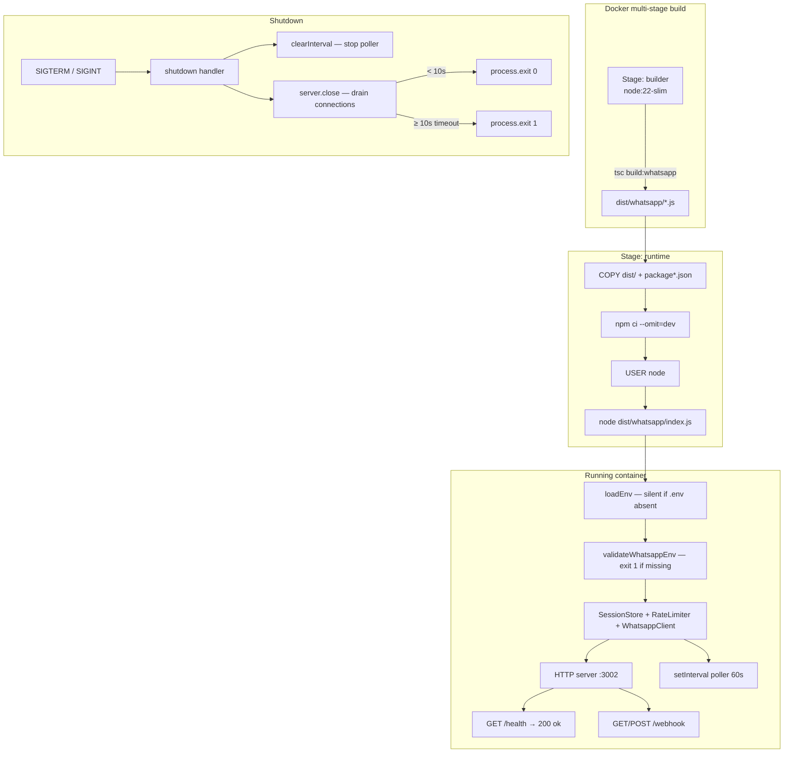

# Design — WhatsApp Bot Deployment

## Overview

The WhatsApp commandes bot (`bot/whatsapp/`) is a stateful Node.js process that cannot run on serverless platforms. It uses `setInterval` for polling commande statuses and keeps conversation sessions in memory. This design specifies exactly what to add to make it container-deployable with no vendor lock-in.

The work is purely **operational** — no new business logic. The outcome is a Docker image that:

- builds from source TypeScript,
- starts as a non-root user,
- exposes a health check on `GET /health`,
- shuts down gracefully on `SIGTERM`/`SIGINT`,
- and never bakes secrets into the image.

### Key constraints

| Constraint | Decision |
|---|---|
| Runtime in production | `node dist/whatsapp/index.js` (compiled JS, no tsx) |
| Runtime in development | `tsx bot/whatsapp/index.ts` (unchanged) |
| Node.js version | 22 (LTS), slim variant |
| Module system | ESM (`"type": "module"`) — NodeNext resolution |
| Secrets | Platform env vars only; never in the image |

---

## Architecture



---

## Components and Interfaces

### 1. npm scripts — `bot/package.json`

Two new scripts are added. The existing `start`, `build`, `generate-jwt`, `test` scripts are unchanged.

```json
"start:whatsapp": "tsx whatsapp/index.ts",
"build:whatsapp": "tsc -p whatsapp/tsconfig.json"
```

`start:whatsapp` uses `tsx` directly (no `node --loader` wrapper) because `tsx` handles the `../loadEnv.js` side-effect import transparently. The working directory when running from `bot/` means `tsx whatsapp/index.ts` resolves the `../loadEnv.js` import to `bot/loadEnv.ts` correctly.

### 2. TypeScript build config — `bot/whatsapp/tsconfig.json`

A dedicated tsconfig in `bot/whatsapp/` that extends the root `tsconfig.json` (if it exists) or is self-contained. This avoids polluting the leads bot compilation.

```jsonc
{
  "compilerOptions": {
    "target": "ES2022",
    "module": "NodeNext",
    "moduleResolution": "NodeNext",
    "outDir": "../dist/whatsapp",
    "rootDir": "..",
    "declaration": false,
    "sourceMap": false,
    "strict": true,
    "esModuleInterop": false,
    "skipLibCheck": true
  },
  "include": [
    "./**/*.ts",
    "../loadEnv.ts"
  ],
  "exclude": [
    "**/*.test.ts",
    "**/*.property.test.ts",
    "../**/*.test.ts",
    "../**/*.property.test.ts"
  ]
}
```

`rootDir` is set to `bot/` (i.e., `..`) because `bot/whatsapp/index.ts` imports `../loadEnv.js`. Without this, tsc would complain about files outside `rootDir`. The output mirrors the source structure: `bot/dist/whatsapp/index.js`, `bot/dist/loadEnv.js`.

**ESM import extensions** (`./foo.js`) are already used throughout the whatsapp source files — tsc with `NodeNext` preserves them as-is, so no rewriting is needed.

### 3. Graceful shutdown — `bot/whatsapp/index.ts` modifications

The `main()` function currently starts the server and poller but installs no signal handlers. The shutdown logic is added at the bottom of `main()`, after the interval is created.

The shutdown handler receives both the `server` reference (returned by `startServer()`) and the `timer` reference (from `setInterval`).

```
shutdown(signal):
  log "[main] Arrêt en cours (${signal})…"
  clearInterval(timer)          → log "[main] Poller arrêté"
  server.close(callback):       → log "[main] Serveur HTTP fermé — exit 0"
    process.exit(0)
  setTimeout(10_000):           → log "[main] Timeout arrêt — exit forcé"
    process.exit(1)

process.on('SIGTERM', () => shutdown('SIGTERM'))
process.on('SIGINT',  () => shutdown('SIGINT'))
```

`server.close()` stops accepting new connections and calls the callback when all existing connections are drained. The 10-second `setTimeout` forces exit if draining takes too long (e.g., keep-alive connections). `clearInterval` is called before `server.close()` so the poller does not fire during the drain window.

### 4. Dockerfile — `bot/whatsapp/Dockerfile`

Multi-stage build. Build context is the `bot/` directory (i.e., `docker build -f whatsapp/Dockerfile .` from `bot/`).

**Stage 1 — builder** (`node:22-slim`):
- Copy `package*.json`, run `npm ci`
- Copy all source files (tsconfig, whatsapp/, loadEnv.ts, etc.)
- Run `npm run build:whatsapp`

**Stage 2 — runtime** (`node:22-slim`):
- Copy `package*.json`, run `npm ci --omit=dev`
- Copy `dist/` from builder stage
- `USER node` (non-root)
- `EXPOSE 3002`
- `HEALTHCHECK --interval=30s --timeout=10s --retries=3 CMD wget -qO- http://localhost:3002/health || exit 1`
- `CMD ["node", "dist/whatsapp/index.js"]`

`wget` is used in the HEALTHCHECK because `node:22-slim` includes it by default. `curl` is not guaranteed in the slim image without an extra `apt-get` layer.

No `.env` files are ever `COPY`-ed. Secrets are injected at runtime via platform environment variables.

### 5. `.dockerignore` — `bot/whatsapp/.dockerignore`

Placed alongside the Dockerfile. Docker uses the Dockerfile directory to locate `.dockerignore` when the `-f` flag is used with a separate context directory. To be safe, a `.dockerignore` is also placed at `bot/.dockerignore`.

Excludes: `node_modules/`, `dist/`, `*.test.ts`, `*.property.test.ts`, `.env`, `.env.local`, `.env.example` (not needed in image).

### 6. `.env.example` — `bot/whatsapp/.env.example`

Documents all variables the bot reads, with placeholder values and explanatory comments. The `loadEnv.ts` loader looks for `bot/.env` and `../.env.local` — neither is present in a container, so all variables come from the platform environment.

### 7. Deployment Guide — `bot/whatsapp/README.md`

Sections:
1. Prerequisites
2. Local development
3. Environment variables reference table
4. Building and running with Docker
5. Deploying to Railway
6. Deploying to Render
7. WhatsApp webhook configuration (Meta Developer Portal)
8. Generating and rotating `BOT_JWT`
9. API endpoints reference
10. Troubleshooting

---

## Data Models

No new data models. The deployment artifacts are files and configuration, not runtime data structures.

The environment variables consumed by the bot at startup:

| Variable | Required | Default | Purpose |
|---|---|---|---|
| `WHATSAPP_TOKEN` | ✓ | — | Bearer token for WhatsApp Cloud API calls |
| `WHATSAPP_PHONE_NUMBER_ID` | ✓ | — | Phone number ID from Meta dashboard |
| `WHATSAPP_APP_SECRET` | ✓ | — | HMAC-SHA256 signature validation secret |
| `WHATSAPP_VERIFY_TOKEN` | ✓ | — | Webhook verification token (Meta handshake) |
| `BOT_JWT` | ✓ | — | JWT for authenticating against the Kiosq API |
| `KIOSQ_API_URL` | ✓ | — | Base URL of the Kiosq REST API |
| `GEMINI_API_KEY` | ✓ | — | Google Gemini API key for NLU classification |
| `WHATSAPP_BOT_PORT` | — | `3002` | HTTP port the bot listens on |
| `NLU_SCORE_SEUIL` | — | `0.6` | Confidence threshold for NLU intent classification |

---

## Correctness Properties

*A property is a characteristic or behavior that should hold true across all valid executions of a system — essentially, a formal statement about what the system should do. Properties serve as the bridge between human-readable specifications and machine-verifiable correctness guarantees.*

The deployment feature is primarily configuration and infrastructure. Most acceptance criteria are SMOKE or EXAMPLE tests. However, the graceful shutdown behavior (Requirement 5) involves logic that varies meaningfully with input (request duration, signal type, timeout threshold) and has universal properties worth verifying with property-based tests.

### Property 1: Clean shutdown exits with code 0

*For any* bot instance with an active HTTP server and poller, when a shutdown signal is received and all in-flight connections drain within the 10-second timeout, the process SHALL exit with code 0.

**Validates: Requirements 5.4**

### Property 2: Timeout shutdown exits with code 1

*For any* bot instance where in-flight connections do not drain within 10 seconds of receiving a shutdown signal, the process SHALL force-exit with code 1.

**Validates: Requirements 5.5**

### Property 3: SIGINT and SIGTERM produce identical outcomes

*For any* shutdown scenario (clean or timeout), receiving SIGINT and receiving SIGTERM SHALL produce the same exit code and the same poller-stopped / server-closed side effects.

**Validates: Requirements 5.6**

### Property 4: Poller is stopped before server close on any shutdown

*For any* bot instance with a running poller interval, triggering shutdown (via either signal) SHALL always call `clearInterval` before `server.close()`, ensuring no poll cycle fires during connection draining.

**Validates: Requirements 5.3**

---

## Error Handling

### Missing environment variables at startup

`validateWhatsappEnv()` already handles this: it logs each missing variable name to stderr and calls `process.exit(1)`. The Dockerfile does not inject secrets — the platform must supply them. If the container starts without required vars, it exits immediately with code 1, which causes the platform to show a clear "exited" status rather than a silently broken bot.

### Shutdown timeout

If `server.close()` does not call its callback within 10 seconds (e.g., a long-lived keep-alive connection), a `setTimeout` fires `process.exit(1)`. This prevents the container from hanging indefinitely during a rolling deploy. The 10-second timeout aligns with typical platform drain windows (Railway, Render both send SIGTERM and wait ~10s before SIGKILL).

### Build failures

If `npm run build:whatsapp` fails (TypeScript errors), the Docker build fails in the builder stage and no broken image is pushed. This is the correct fail-fast behavior.

### Health check failures

The Docker `HEALTHCHECK` marks the container `unhealthy` after 3 consecutive failures (3 × 30s = 90s). Platforms that support Docker health checks (Railway, Render via `healthcheckPath`) will restart unhealthy containers automatically.

---

## Testing Strategy

### Unit / example-based tests

- Verify the graceful shutdown function calls `clearInterval` and `server.close()` in the correct order using mocks.
- Verify the shutdown logs the expected step messages to stdout.
- Verify `/health` returns `{ "status": "ok" }`, HTTP 200, and `Content-Type: application/json`.
- Verify `loadEnv.ts` does not throw when `.env` is absent.

### Property-based tests (vitest + fast-check)

The project already uses `fast-check` (version 4.9.0 per `bot/package.json`). Property tests live alongside the module they test, following the `*.property.test.ts` convention already established in the codebase.

**Property 1 — Clean shutdown exits 0**

```
Feature: whatsapp-bot-deployment, Property 1: clean-shutdown-exits-0
```

Generate random numbers of in-flight request durations all under 10s. For each, simulate the shutdown handler receiving SIGTERM with a mock `server.close` that calls back immediately. Assert `process.exit` was called with 0.

**Property 2 — Timeout shutdown exits 1**

```
Feature: whatsapp-bot-deployment, Property 2: timeout-shutdown-exits-1
```

Generate shutdown scenarios where `server.close` never calls back. Assert the 10s `setTimeout` fires `process.exit(1)` before any other exit.

**Property 3 — SIGINT === SIGTERM**

```
Feature: whatsapp-bot-deployment, Property 3: sigint-equals-sigterm
```

For any shutdown scenario (random combination of request duration, poller active/inactive), assert that the outcome (exit code, call order) is identical regardless of which signal triggered the shutdown.

**Property 4 — Poller cleared before server close**

```
Feature: whatsapp-bot-deployment, Property 4: poller-cleared-before-server-close
```

For any bot state (poller running or not), assert that `clearInterval` is always called before `server.close()` during shutdown — verified by tracking call order with mock functions.

Each property test runs a minimum of 100 iterations.

### Integration / smoke tests

- `npm run build:whatsapp` compiles without TypeScript errors (CI step).
- `docker build` succeeds and produces a valid image (CI step).
- `GET /health` on a running container returns 200 (post-deploy smoke test).

---

## WhatsApp Client Integration

This section covers the front-end and API changes needed so that the Kiosq web app and the WhatsApp bot share a consistent client identity model.

### 1. Phone normalization — `src/lib/phone.ts`

A pure utility function strips all formatting characters and the leading `+` from any raw phone string:

```typescript
// src/lib/phone.ts
export function normalizePhone(raw: string): string {
  return raw.replace(/[\s\-\(\)\+]/g, '');
}
```

Usage points:
- **Client form** (`ClientsPage.tsx`): called on the `telephone` field value inside `handleSubmit` before the API call, so the stored value is always digits-only.
- **Bot** (`bot/whatsapp/kiosqWhatsappApi.ts`): the bot already receives the caller's number from Meta in E.164 format (e.g. `22612345678` — digits only, no `+`). `createClient()` passes it as-is, which already satisfies Requirement 10.6.

**Property 5 — idempotence and digit-only output:**

```
∀ raw ∈ String:
  normalizePhone(raw) contains only [0-9] characters
  normalizePhone(normalizePhone(raw)) === normalizePhone(raw)
```

This is a round-trip / idempotence property testable with `fast-check`.

### 2. `GET /api/clients?telephone=<value>` — exact match lookup

The existing GET handler in `api/clients/index.ts` supports only `?q=` (case-insensitive `ilike` search on nom and email). The bot calls `getClient(telephone)` which needs an **exact match** on the `telephone` column.

Add a `telephone` branch before the existing `q` branch:

```typescript
const telephone = req.query.telephone as string | undefined;
if (telephone) {
  rows = await db.select().from(clients)
    .where(and(eq(clients.tenantId, ctx.tenantId), eq(clients.telephone, telephone)))
    .orderBy(desc(clients.createdAt));
  return ok(res, numericRows(rows));
}
```

The `eq()` operator from `drizzle-orm` is already imported. No schema changes needed — `telephone` is an existing nullable text column.

### 3. WhatsApp badge in `ClientsPage`

In the client name cell of the table, conditionally render a small green `MessageCircle` icon (from `lucide-react`, which is already imported across the project) when `c.notes?.includes('WhatsApp')` is true:

```tsx
import { MessageCircle } from 'lucide-react'; // add to existing import

// Inside the <td> for client name:
<div className="flex items-center gap-3">
  {/* existing avatar */}
  <div>
    <p className="text-sm font-medium flex items-center gap-1.5" style={{ color: 'var(--color-ink)' }}>
      {c.nom}
      {c.notes?.includes('WhatsApp') && (
        <MessageCircle size={13} className="shrink-0" style={{ color: '#25D366' }} />
      )}
    </p>
    <p className="text-xs font-mono" style={{ color: 'var(--color-ink-muted)' }}>{c.code}</p>
  </div>
</div>
```

This is purely additive — no state, no new data fetch, no impact on existing filters.

### 4. WhatsApp link in client detail page

In `src/pages/clients/ClientDetailPage.tsx`, add a conditional anchor next to or below the phone number display:

```tsx
{client.telephone && (
  <a
    href={`https://wa.me/${client.telephone}`}
    target="_blank"
    rel="noopener noreferrer"
    className="flex items-center gap-1.5 text-xs font-medium"
    style={{ color: '#25D366' }}
  >
    <MessageCircle size={13} />
    Contacter sur WhatsApp
  </a>
)}
```

The `telephone` value stored in the DB is already normalized (digits only), so `https://wa.me/22612345678` is a valid wa.me deep link with no further transformation needed.

### 5. Correctness property for phone normalization

**Property 5 — `normalizePhone` is idempotent and produces digit-only output**

*For all* raw strings `s`, `normalizePhone(s)` SHALL:
1. Contain only characters in `[0-9]`
2. Satisfy `normalizePhone(normalizePhone(s)) === normalizePhone(s)` (applying it twice is the same as once)

**Validates: Requirements 10.1, 10.2, 10.3**

This property is implemented as `src/lib/phone.property.test.ts` using `fast-check` (already present in the project as a dev dependency).
