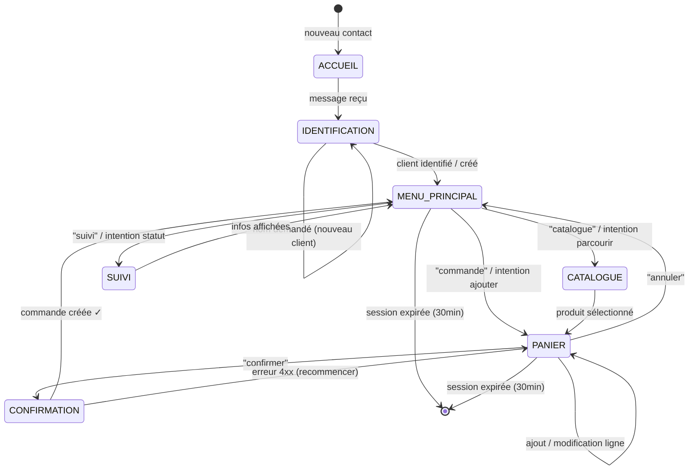

# Document de Design — WhatsApp Commandes Bot

## Vue d'ensemble

Le bot WhatsApp de gestion de commandes est un service Node.js autonome hébergé dans `bot/whatsapp/` qui permet aux clients d'une boutique Kiosq de passer des commandes, consulter le catalogue produits et suivre l'état de leurs commandes directement depuis WhatsApp. Il s'intègre à l'[API WhatsApp Business Cloud](https://developers.facebook.com/docs/whatsapp/cloud-api/) de Meta pour la réception et l'envoi de messages, à l'API Kiosq existante pour les données métier, et à Google Gemini pour la compréhension du langage naturel.

Le bot s'appuie sur les modules existants dans `bot/` (`gemini.ts`, `kiosqApi.ts`, `loadEnv.ts`, `validateEnv.ts`) et en ajoute un nouveau sous-dossier `bot/whatsapp/` pour isoler la logique propre aux commandes WhatsApp. Il n'y a **pas d'accès direct à la base de données** — tout passe par l'API Kiosq avec un JWT Bearer (`BOT_JWT`).

### Principes clés

- **Isolation** : le nouveau bot vit dans `bot/whatsapp/`, sans modifier `bot/index.ts`
- **Stateless côté HTTP** : l'état de session est conservé en mémoire (Map + TTL 30 min)
- **Sécurité** : validation HMAC-SHA256 sur chaque requête entrante, rate limiting par numéro
- **Résilience** : fallback vers menu numéroté si Gemini est indisponible, retry sur erreurs 5xx
- **Multi-tenant via JWT** : le `BOT_JWT` est scopé à un tenant unique, l'isolation est garantie par l'API


## Architecture

```mermaid
graph TB
    subgraph "Client"
        WA[Client WhatsApp<br/>numéro de téléphone]
    end

    subgraph "Meta Cloud API"
        WAPI[WhatsApp Cloud API<br/>graph.facebook.com]
    end

    subgraph "bot/whatsapp/ — Service Node.js"
        direction TB
        SRV[server.ts<br/>HTTP Server Express-like]
        WH[webhook.ts<br/>Réception & routage]
        SIG[security.ts<br/>HMAC-SHA256 + Rate Limiting]
        SESS[sessionStore.ts<br/>Map&lt;phone, Session&gt; + TTL 30min]
        CONV[conversationHandler.ts<br/>State machine du flux]
        NLU[geminiNlu.ts<br/>Intent classifier]
        WC[whatsappClient.ts<br/>Envoi messages via Cloud API]
        NOTIF[notificationPoller.ts<br/>Polling statuts commandes]
        WKAPI[kiosqWhatsappApi.ts<br/>Appels API Kiosq spécifiques]
    end

    subgraph "API Kiosq — Vercel Serverless"
        API[/api/produits<br/>/api/clients<br/>/api/commandes<br/>/api/parametres]
    end

    subgraph "Services externes"
        GEMINI[Google Gemini API]
    end

    WA -->|messages entrants| WAPI
    WAPI -->|POST /webhook| WH
    WH --> SIG
    SIG -->|requête valide| CONV
    SIG -->|403 si signature invalide| WAPI
    CONV <--> SESS
    CONV --> NLU
    CONV --> WKAPI
    CONV --> WC
    NLU --> GEMINI
    WC -->|POST /{phone_number_id}/messages| WAPI
    WAPI -->|messages sortants| WA
    WKAPI --> API
    NOTIF -->|polling toutes 60s| WKAPI
    NOTIF --> WC
```


### Machine d'états conversationnelle

Le flux de commande suit une machine d'états dont chaque session conserve l'état courant (`SessionStep`).




## Composants et interfaces

### Structure des fichiers

```
bot/
  whatsapp/
    server.ts                — Point d'entrée HTTP (port 3002), santé GET /health
    webhook.ts               — Routeur: GET verification hub.challenge, POST messages
    security.ts              — validateHmacSignature(), RateLimiter class
    sessionStore.ts          — SessionStore class (Map + TTL sweep toutes les 5min)
    conversationHandler.ts   — handleIncomingMessage(), dispatch par intent/step
    geminiNlu.ts             — classifierMessage() : intent + produit + score
    whatsappClient.ts        — sendTextMessage(), sendListMessage()
    kiosqWhatsappApi.ts      — Wraps kiosqRequest() : clients, produits, commandes, parametres
    notificationPoller.ts    — pollCommandeStatuts() : polling toutes les 60s
    validateEnv.ts           — validateWhatsappEnv() : variables requises
    loadEnv.ts               — charge .env depuis bot/whatsapp/.env
    index.ts                 — main() : lance server + poller
    package.json             — scripts: start, test, build (hérite de bot/package.json si monorepo)
```

### Interfaces TypeScript clés

#### Session

```typescript
export type SessionStep =
  | 'ACCUEIL'
  | 'IDENTIFICATION'
  | 'MENU_PRINCIPAL'
  | 'CATALOGUE'
  | 'PANIER'
  | 'CONFIRMATION'
  | 'SUIVI';

export interface LignePanier {
  produitId: string;
  designation: string;
  prixUnitaire: number;  // en unité de devise du tenant
  quantite: number;
  totalLigne: number;    // prixUnitaire * quantite
}

export interface Session {
  phone: string;          // numéro WhatsApp normalisé (E.164 sans +)
  clientId: string | null;
  clientNom: string | null;
  step: SessionStep;
  panier: LignePanier[];
  tvaRate: number;        // taux TVA du tenant (ex: 18)
  devise: string;         // devise du tenant (ex: "XOF")
  lastActivity: number;   // Date.now() au dernier message
  pendingNomCapture: boolean;  // true si on attend le nom d'un nouveau client
}
```


#### Messages WhatsApp entrants (format Cloud API)

```typescript
// Payload webhook WhatsApp Cloud API (format imbriqué)
export interface WhatsAppWebhookPayload {
  object: string;  // "whatsapp_business_account"
  entry: Array<{
    id: string;
    changes: Array<{
      value: {
        messaging_product: string;
        metadata: { display_phone_number: string; phone_number_id: string };
        contacts?: Array<{ profile: { name: string }; wa_id: string }>;
        messages?: Array<IncomingMessage>;
        statuses?: Array<MessageStatus>;
      };
      field: string;
    }>;
  }>;
}

export interface IncomingMessage {
  from: string;   // numéro expéditeur (E.164 sans +)
  id: string;     // wamid unique
  timestamp: string;
  type: 'text' | 'image' | 'document' | 'audio' | 'video' | 'sticker' | 'location' | 'interactive';
  text?: { body: string };
  image?: { id: string; mime_type: string; caption?: string };
  document?: { id: string; filename?: string; caption?: string };
}

export interface MessageStatus {
  id: string;
  status: 'sent' | 'delivered' | 'read' | 'failed';
  timestamp: string;
  recipient_id: string;
}
```

#### Intent NLU (Gemini)

```typescript
export type IntentName =
  | 'PARCOURIR_CATALOGUE'
  | 'AJOUTER_PRODUIT'
  | 'CONFIRMER_COMMANDE'
  | 'VOIR_STATUT'
  | 'MODIFIER_PANIER'
  | 'ANNULER'
  | 'AIDE'
  | 'INCONNU';

export interface NluResult {
  intent: IntentName;
  score: number;        // 0–1 confiance
  produit?: string | null;   // nom produit détecté
  quantite?: number | null;  // quantité détectée
}
```


#### API Kiosq — types retournés

```typescript
export interface ProduitDisponible {
  id: string;
  designation: string;
  prixVente: number;
  stockActuel: number;
  categorieId: string | null;
  unite: string;
}

export interface ClientKiosq {
  id: string;
  nom: string;
  telephone: string | null;
  email: string | null;
  tenantId: string;
}

export interface CommandeCreee {
  id: string;
  numero: string;   // ex: "CMD-2025-001"
  statut: string;
  totalTTC: number;
  dateCommande: string;
}

export interface ParametresTenant {
  tva: string;     // "18" par défaut
  devise: string;  // "XOF" par défaut
}
```

### Composant `SessionStore`

```typescript
const SESSION_TTL_MS = 30 * 60 * 1000;  // 30 minutes

export class SessionStore {
  private sessions = new Map<string, Session>();

  get(phone: string): Session | undefined { ... }
  set(phone: string, session: Session): void { ... }
  touch(phone: string): void { /* met à jour lastActivity */ }
  delete(phone: string): void { ... }
  isExpired(session: Session): boolean {
    return Date.now() - session.lastActivity > SESSION_TTL_MS;
  }
  sweep(): void { /* supprime les sessions expirées, appelé toutes les 5min */ }
}
```

### Composant `RateLimiter`

```typescript
// Token bucket par numéro — 60 messages par minute
export class RateLimiter {
  private counters = new Map<string, { count: number; resetAt: number }>();
  
  isAllowed(phone: string): boolean {
    const now = Date.now();
    const entry = this.counters.get(phone);
    if (!entry || now > entry.resetAt) {
      this.counters.set(phone, { count: 1, resetAt: now + 60_000 });
      return true;
    }
    if (entry.count >= 60) return false;
    entry.count++;
    return true;
  }
}
```

### Composant `validateHmacSignature`

```typescript
import { createHmac, timingSafeEqual } from 'node:crypto';

export function validateHmacSignature(
  rawBody: Buffer,
  appSecret: string,
  signatureHeader: string,  // "sha256=<hex>"
): boolean {
  const expected = createHmac('sha256', appSecret)
    .update(rawBody)
    .digest('hex');
  const provided = signatureHeader.replace('sha256=', '');
  try {
    return timingSafeEqual(Buffer.from(expected, 'hex'), Buffer.from(provided, 'hex'));
  } catch {
    return false;
  }
}
```


### Composant `geminiNlu.ts`

Le prompt NLU est différent du `bot/gemini.ts` existant (qui classe des posts Facebook). Ici on identifie l'intention dans un contexte de commande :

```typescript
const PROMPT_NLU = `Tu es l'assistant de commande d'une boutique. Analyse le message suivant d'un client WhatsApp et identifie :
1. L'intention parmi : PARCOURIR_CATALOGUE, AJOUTER_PRODUIT, CONFIRMER_COMMANDE, VOIR_STATUT, MODIFIER_PANIER, ANNULER, AIDE, INCONNU
2. Le produit mentionné (ou null)
3. La quantité mentionnée (ou null)

Contexte actuel de la session :
{{SESSION_CONTEXT}}

Réponds UNIQUEMENT en JSON valide :
{"intent": "<INTENT>", "score": <0-1>, "produit": "<nom ou null>", "quantite": <nombre ou null>}`;

export async function classifierMessage(
  message: string,
  sessionContext: { step: SessionStep; panierSize: number },
  fetchFn?: typeof fetch,
): Promise<NluResult>
```

Le contexte de session (step courant, taille du panier) est injecté dans le prompt pour améliorer la pertinence, conformément à la Requirement 7.6.

### Composant `notificationPoller.ts`

Mécanisme de polling toutes les 60 secondes qui détecte les changements de statut des commandes associées à des sessions actives ou récentes :

```typescript
const TRANSITIONS_NOTIFIABLES = new Set([
  'brouillon→confirme',
  'confirme→en_preparation',
  'en_preparation→expedie',
  'expedie→livre',
]);

export async function pollCommandeStatuts(
  sessionStore: SessionStore,
  kiosqApi: KiosqWhatsappApi,
  whatsappClient: WhatsappClient,
): Promise<void>
// Compare les statuts connus (Map en mémoire) avec les statuts actuels via GET /api/commandes
// Envoie notification WhatsApp si transition éligible détectée
```

**Note de design** : le polling est la solution retenue plutôt qu'un webhook sortant depuis l'API Kiosq, car cela ne nécessite aucune modification de l'API existante. Le bot maintient en mémoire une `Map<commandeId, statut>` pour les commandes des sessions actives et les commandes créées depuis moins de 7 jours.


### Intégration WhatsApp Cloud API

**Réception (webhook entrant) :**
- `GET /webhook?hub.mode=subscribe&hub.challenge=<token>&hub.verify_token=<configured>` → répond la valeur `hub.challenge`
- `POST /webhook` avec header `X-Hub-Signature-256: sha256=<hmac>` → valider avant tout traitement

**Envoi de messages (whatsappClient.ts) :**
```
POST https://graph.facebook.com/v20.0/{WHATSAPP_PHONE_NUMBER_ID}/messages
Authorization: Bearer {WHATSAPP_TOKEN}
Content-Type: application/json

{
  "messaging_product": "whatsapp",
  "recipient_type": "individual",
  "to": "<numéro_E164>",
  "type": "text",
  "text": { "preview_url": false, "body": "<message>" }
}
```

Le bot répond toujours HTTP 200 à WhatsApp immédiatement (avant traitement asynchrone) pour éviter les retry automatiques de Meta.


## Modèles de données

### Pas de nouvelles tables DB

Le bot n'a pas d'accès direct à la base de données. Toutes les données sont lues et écrites via l'API Kiosq. L'état conversationnel (Session, Panier) est conservé **en mémoire uniquement**.

### Lignes de commande transmises à l'API

Le bot crée les commandes via `POST /api/commandes` en utilisant le format `lignes` (JSONB) existant :

```typescript
interface LigneCommande {
  produitId: string;
  designation: string;
  unite: string;
  quantite: number;
  prixUnitaire: number;
  remise: number;        // toujours 0 depuis le bot
  total: number;         // prixUnitaire * quantite
}

interface CommandePayload {
  clientId: string | null;
  clientNom: string;
  lignes: LigneCommande[];
  totalHT: number;
  tva: number;           // taux (ex: 18)
  totalTTC: number;      // totalHT * (1 + tva/100)
  statut: 'brouillon';
  notes: string;         // "Commande via WhatsApp"
}
```

### Variables d'environnement

| Variable | Description | Obligatoire |
|---|---|---|
| `WHATSAPP_TOKEN` | Token Bearer pour l'API Graph Meta | Oui |
| `WHATSAPP_PHONE_NUMBER_ID` | ID du numéro de téléphone WhatsApp Business | Oui |
| `WHATSAPP_APP_SECRET` | Secret de l'app Meta pour validation HMAC | Oui |
| `WHATSAPP_VERIFY_TOKEN` | Token de vérification webhook (dev) | Oui |
| `BOT_JWT` | JWT Bearer pour l'API Kiosq (scopé au tenant) | Oui |
| `KIOSQ_API_URL` | URL de base de l'API Kiosq | Oui |
| `GEMINI_API_KEY` | Clé API Google Gemini | Oui |
| `WHATSAPP_BOT_PORT` | Port HTTP du serveur (défaut: 3002) | Non |
| `NLU_SCORE_SEUIL` | Seuil de confiance Gemini (défaut: 0.6) | Non |


## Correctness Properties

*Une propriété est une caractéristique ou un comportement qui doit rester vrai pour toutes les exécutions valides d'un système — formellement, un énoncé sur ce que le système doit faire. Les propriétés servent de pont entre les spécifications lisibles par l'humain et les garanties de correction vérifiables par la machine.*

### Réflexion sur la redondance

Avant d'écrire les propriétés finales, voici l'analyse de redondance :

- **3.1 et 3.3** (filtrage catalogue) : les deux testent un invariant de filtre sur les produits. On les combine en une seule propriété « tous les produits retournés satisfont les filtres actifs ».
- **3.2** (pagination par 10) est distincte et non redondante.
- **4.1 et 4.2** (ajout panier et total) : la propriété de calcul des totaux est plus forte. On les combine en une propriété qui teste à la fois la présence de la ligne ET la cohérence du total.
- **5.1 et 5.6** (calcul totalTTC) : identiques, on garde une seule propriété sur le calcul TVA.
- **5.3** (effacement session après commande) est distincte.
- **7.2 et 7.3** (seuil NLU) : le seuil `>= 0.6` et `< 0.6` sont les deux faces d'une même propriété binaire — une seule propriété suffit.
- **9.3** (HMAC) et **1.3** (hub.challenge) sont des propriétés sur des fonctions pures distinctes.
- **6.1 et 6.2** (suivi commande) : ownership check et format d'affichage sont distincts mais peuvent être vérifiés ensemble dans une propriété de round-trip de lecture.
- **8.3** (transitions notifiables) subsume **8.2** (envoi notification si détecté) — on garde une seule propriété sur le filtrage des transitions.
- **10.2** (variables manquantes) est une propriété distincte sur la validation d'environnement.

**Propriétés retenues après réflexion : 10 propriétés.**


### Propriété 1 : Vérification hub.challenge — round-trip

*Pour toute* valeur de chaîne `hub.challenge` (y compris chaînes vides, unicode, caractères spéciaux), le handler de vérification webhook doit retourner exactement cette valeur avec HTTP 200.

```
∀ challenge ∈ String :
  handleVerification({ hub_challenge: challenge }) === challenge
```

**Valide : Requirements 1.3**

---

### Propriété 2 : Robustesse aux payloads malformés

*Pour tout* corps de requête POST arbitraire (JSON invalide, objet vide, champs manquants, types incorrects), le handler webhook doit retourner HTTP 200 sans lever d'exception.

```
∀ body ∈ ArbitraryBytes :
  handleWebhook(body) → { status: 200 }  (jamais d'exception non catchée)
```

**Valide : Requirements 1.4**

---

### Propriété 3 : Filtrage catalogue — tous les produits retournés sont éligibles

*Pour tout* catalogue de produits contenant un mélange de produits actifs/inactifs et avec stocks variés, la liste retournée par `filterCatalogue()` contient uniquement les produits satisfaisant `actif === true && stockActuel > 0`. Si un filtre `categorieId` est actif, tous les résultats doivent en plus avoir ce `categorieId`.

```
∀ produits ∈ Produit[], categorie? ∈ String :
  filterCatalogue(produits, categorie).every(p =>
    p.actif === true && p.stockActuel > 0 &&
    (categorie === undefined || p.categorieId === categorie)
  )
```

**Valide : Requirements 3.1, 3.3**

---

### Propriété 4 : Pagination catalogue — max 10 produits par message

*Pour toute* liste de produits de taille N quelconque, le découpage en lots (`chunkCatalogue()`) produit des lots dont la taille est toujours ≤ 10 et la concaténation de tous les lots reconstitue la liste originale complète.

```
∀ produits ∈ Produit[] :
  let lots = chunkCatalogue(produits)
  lots.every(lot => lot.length <= 10) &&
  lots.flat().length === produits.length
```

**Valide : Requirements 3.2**


---

### Propriété 5 : Invariant du panier — cohérence des totaux

*Pour tout* panier contenant un ensemble quelconque de lignes (produit, prix, quantité), la fonction `computePanierTotaux()` doit satisfaire : `totalHT = Σ(ligne.prixUnitaire * ligne.quantite)` et `totalTTC = totalHT * (1 + tvaRate / 100)`.

```
∀ lignes ∈ LignePanier[], tvaRate ∈ [0, 100] :
  let { totalHT, totalTTC } = computePanierTotaux(lignes, tvaRate)
  totalHT === sum(lignes.map(l => l.prixUnitaire * l.quantite)) &&
  Math.abs(totalTTC - totalHT * (1 + tvaRate / 100)) < 0.01
```

**Valide : Requirements 4.1, 4.2, 5.1, 5.6**

---

### Propriété 6 : Session effacée après confirmation de commande

*Pour tout* état de session contenant un panier non vide, après l'appel à `clearSessionAfterOrder()`, la session doit avoir un panier vide (`panier.length === 0`) et le step doit être `MENU_PRINCIPAL`.

```
∀ session ∈ Session tel que session.panier.length > 0 :
  let updated = clearSessionAfterOrder(session)
  updated.panier.length === 0 && updated.step === 'MENU_PRINCIPAL'
```

**Valide : Requirements 5.3**

---

### Propriété 7 : Isolation commande — ownership check

*Pour tout* appel à `checkCommandeOwnership(commande, sessionClientId)`, la fonction retourne `true` si et seulement si `commande.clientId === sessionClientId`. Aucune commande d'un autre client ne doit jamais être accessible.

```
∀ commande ∈ Commande, sessionClientId ∈ String :
  checkCommandeOwnership(commande, sessionClientId) ⟺ commande.clientId === sessionClientId
```

**Valide : Requirements 6.1, 6.4**

---

### Propriété 8 : Validation HMAC-SHA256 — accept/reject symétrique

*Pour tout* corps de requête `body` et secret `appSecret`, un HMAC calculé correctement doit être accepté, et toute signature modifiée doit être rejetée.

```
∀ body ∈ Buffer, appSecret ∈ String :
  let validSig = computeHmac(body, appSecret)
  validateHmacSignature(body, appSecret, 'sha256=' + validSig) === true

∀ body ∈ Buffer, appSecret ∈ String, tampered ∈ String tel que tampered ≠ computeHmac(body, appSecret) :
  validateHmacSignature(body, appSecret, 'sha256=' + tampered) === false
```

**Valide : Requirements 9.3**


---

### Propriété 9 : Filtrage des transitions de statut notifiables

*Pour tout* couple `(ancienStatut, nouveauStatut)` de l'enum `statutCommande`, la fonction `isTransitionNotifiable()` retourne `true` si et seulement si la transition fait partie de l'ensemble autorisé : `{brouillon→confirme, confirme→en_preparation, en_preparation→expedie, expedie→livre}`.

```
∀ (ancien, nouveau) ∈ StatutCommande × StatutCommande :
  isTransitionNotifiable(ancien, nouveau) ⟺
    (ancien, nouveau) ∈ {
      ('brouillon', 'confirme'),
      ('confirme', 'en_preparation'),
      ('en_preparation', 'expedie'),
      ('expedie', 'livre')
    }
```

**Valide : Requirements 8.3**

---

### Propriété 10 : Validation d'environnement — rapport des variables manquantes

*Pour tout* sous-ensemble non vide des variables d'environnement requises qui est absent, la fonction `validateWhatsappEnv()` doit lancer une erreur (ou appeler `process.exit(1)`) et le message d'erreur doit contenir le nom de chaque variable manquante.

```
∀ manquantes ⊆ REQUIRED_VARS, manquantes ≠ ∅ :
  let error = captureValidationError(env_sans(manquantes))
  manquantes.every(varName => error.message.includes(varName))
```

**Valide : Requirements 10.1, 10.2**


## Gestion des erreurs

### Webhook entrant

| Situation | Comportement | HTTP |
|---|---|---|
| Signature HMAC invalide | Rejeter, log warning | 403 |
| Corps malformé / non-JSON | Ignorer, log error | 200 |
| Rate limit dépassé (>60/min) | Ignorer silencieusement | 200 |
| `AuthError` depuis kiosqApi | Arrêter traitement, log critique, message générique au client | 200 |
| Erreur 5xx de l'API Kiosq | Retry une fois après 5s, puis message d'erreur temporaire | 200 |
| Erreur 4xx de l'API Kiosq | Message d'erreur explicite au client, proposer recommencer | 200 |
| Gemini indisponible | Fallback vers menu numéroté | 200 |
| Session expirée | Effacer session, notifier client, redémarrer flux | 200 |

**Règle critique** : le webhook répond toujours HTTP 200 à WhatsApp Cloud API, même en cas d'erreur de traitement interne, pour éviter les retries automatiques de Meta qui doubleraient les messages aux clients.

### Bot de notifications (polling)

| Situation | Comportement |
|---|---|
| Erreur réseau vers API Kiosq | Log warning, retry au prochain cycle (60s) |
| Envoi notification WhatsApp échoue | Retry une fois après 60s, log résultat |
| `AuthError` depuis kiosqApi | Log critique, arrêt du poller, alerte opérateur |

### Erreurs émises vers les clients WhatsApp

Les messages d'erreur aux clients sont toujours formulés en langage naturel, sans exposer de détails techniques. Exemples :

- Erreur API : *"Je rencontre un problème temporaire. Veuillez réessayer dans quelques instants."*
- Produit indisponible : *"Ce produit n'est plus disponible en quantité suffisante. Stock actuel : X unités."*
- Session expirée : *"Votre session a expiré après 30 minutes d'inactivité. Envoyez un message pour recommencer."*
- Commande introuvable : *"Je ne trouve pas cette commande. Vérifiez le numéro et réessayez."*


## Stratégie de tests

### Approche duale

Le module utilise deux types de tests complémentaires :

1. **Tests unitaires / exemples** : couvrent des scénarios spécifiques, les chemins d'erreur, et les cas limites.
2. **Tests basés sur les propriétés** (fast-check) : vérifient les invariants universels sur des entrées générées aléatoirement.

### Tests de propriétés (fast-check)

La librairie choisie est **[fast-check](https://fast-check.dev/)** v4.9.0, déjà installée dans `bot/package.json`.

Configuration :
- Minimum **100 itérations** par test de propriété (paramètre `numRuns: 100`)
- Chaque test est étiqueté : `Feature: whatsapp-commandes-bot, Property N: <texte>`

```typescript
// Exemple de structure pour Propriété 5 :
// Feature: whatsapp-commandes-bot, Property 5: invariant panier cohérence des totaux
it('Property 5 — totaux du panier cohérents', () => {
  fc.assert(
    fc.property(
      fc.array(fc.record({
        prixUnitaire: fc.float({ min: 0.01, max: 999999, noNaN: true }),
        quantite: fc.integer({ min: 1, max: 1000 }),
      })),
      fc.float({ min: 0, max: 100, noNaN: true }),
      (lignes, tvaRate) => {
        const { totalHT, totalTTC } = computePanierTotaux(lignes, tvaRate);
        const expectedHT = lignes.reduce((s, l) => s + l.prixUnitaire * l.quantite, 0);
        return (
          Math.abs(totalHT - expectedHT) < 0.01 &&
          Math.abs(totalTTC - expectedHT * (1 + tvaRate / 100)) < 0.01
        );
      }
    ),
    { numRuns: 100 }
  );
});
```

### Plan de tests par fichier

#### `bot/whatsapp/webhook.ts` (Propriétés 1, 2)

- **PBT** : Property 1 — hub.challenge round-trip (générateur `fc.string()`)
- **PBT** : Property 2 — payloads malformés (générateurs `fc.anything()`, `fc.string()`, `fc.uint8Array()`)
- **Unitaire** : POST avec signature valide → traitement effectué
- **Unitaire** : POST sans signature → HTTP 403

#### `bot/whatsapp/security.ts` (Propriété 8)

- **PBT** : Property 8 — HMAC accept/reject symétrique (générateurs `fc.uint8Array()`, `fc.string()`, `fc.hexaString()`)
- **Unitaire** : signature vide → false ; format invalide (`sha256=` absent) → false

#### `bot/whatsapp/kiosqWhatsappApi.ts` ou helper pur (Propriétés 3, 4)

- **PBT** : Property 3 — filtrage catalogue (générateur `fc.array(fc.record({ actif: fc.boolean(), stockActuel: fc.integer({ min: 0, max: 100 }), categorieId: fc.option(fc.string()) }))`)
- **PBT** : Property 4 — pagination (générateur `fc.array(fc.anything(), { maxLength: 500 })`)

#### `bot/whatsapp/conversationHandler.ts` (Propriétés 5, 6, 7)

- **PBT** : Property 5 — totaux panier (générateurs lignes avec prix/quantité aléatoires, tva [0, 100])
- **PBT** : Property 6 — session effacée (générateur de sessions avec panier non vide)
- **PBT** : Property 7 — ownership check (générateurs `fc.string()` pour clientId commande vs session)
- **Unitaire** : ajout produit hors stock → message d'erreur avec stock disponible
- **Unitaire** : session expirée → effacement automatique au message suivant
- **Unitaire** : Gemini indisponible → fallback menu numéroté
- **Unitaire** : flux complet (ACCUEIL → IDENTIFICATION → PANIER → CONFIRMATION)

#### `bot/whatsapp/notificationPoller.ts` (Propriété 9)

- **PBT** : Property 9 — transitions notifiables (générateurs de paires `(ancien, nouveau)` depuis l'enum `StatutCommande`)
- **Unitaire** : polling détecte changement → notification envoyée
- **Unitaire** : notifications désactivées → pas de message envoyé
- **Unitaire** : envoi échoue → retry après 60s

#### `bot/whatsapp/validateEnv.ts` (Propriété 10)

- **PBT** : Property 10 — variables manquantes reportées (générateur de sous-ensembles des variables requises)
- **Unitaire** : toutes les variables présentes → pas d'erreur

#### Tests d'intégration (contre API Kiosq de test)

- 1-2 scénarios de bout en bout : message WhatsApp simulé → identification client → ajout panier → création commande → vérification dans `/api/commandes`
- Vérification que le `BOT_JWT` est bien transmis dans tous les appels API
- Vérification que le bot ne retourne jamais de données d'un autre tenant (isolation)

